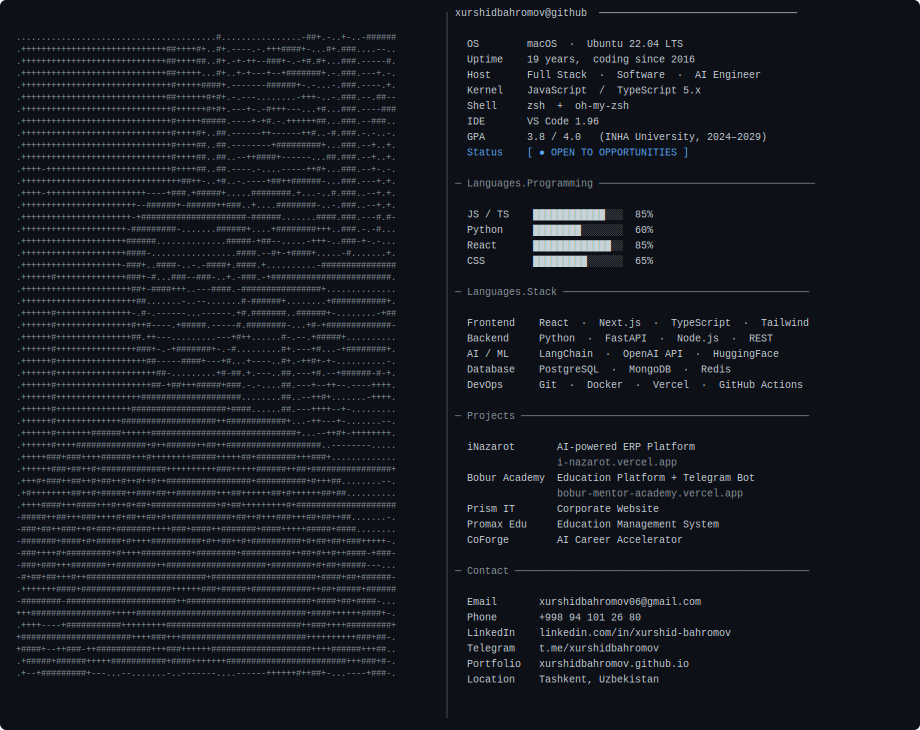

<table width="100%">
<tr>
<td width="42%" valign="top">

</td>
<td width="58%" valign="top">

```
xurshidbahromov@github ─────────────────────────

  OS       macOS · Ubuntu 22.04 LTS
  Uptime   19 years · dev since 2016
  Host     Full Stack · Software · AI Eng
  Kernel   JavaScript / TypeScript 5.x
  Shell    zsh + oh-my-zsh
  IDE      VS Code 1.96
  GPA      3.8 / 4.0 · INHA Univ 2024–29
  Status   [ ● OPEN TO OPPORTUNITIES ]

─ Languages ─────────────────────────────────────

  JS / TS   ████████████░░  85%
  Python    ████████░░░░░░  60%
  React     █████████████░  85%
  CSS       █████████░░░░░  65%

─ Stack ─────────────────────────────────────────

  React · Next.js · TypeScript · Tailwind
  Python · FastAPI · Node.js · REST
  LangChain · OpenAI API · HuggingFace
  Git · Docker · Vercel · GitHub Actions

─ Projects ──────────────────────────────────────

  iNazarot     AI ERP · i-nazarot.vercel.app
  Bobur Acad.  Education + Telegram Bot
  Prism IT     Corporate Website
  Promax Edu   Education Management System
  CoForge      AI Career Accelerator

─ Contact ───────────────────────────────────────

  Email      xurshidbahromov06@gmail.com
  Phone      +998 94 101 26 80
  LinkedIn   linkedin.com/in/xurshid-bahromov
  Telegram   t.me/xurshidbahromov
  Portfolio  xurshidbahromov.github.io
  Location   Tashkent, Uzbekistan
```

</td>
</tr>
</table>

---


<div align="center">

<table>
<tr>
<td></td>
<td></td>
</tr>
</table>


<br/><br/>


</div>
